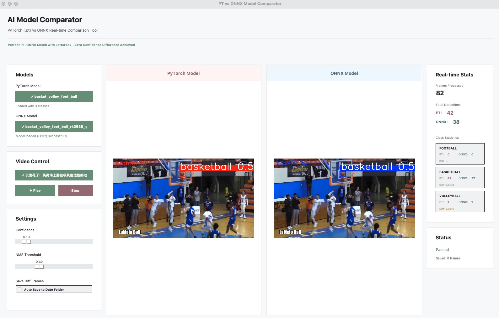
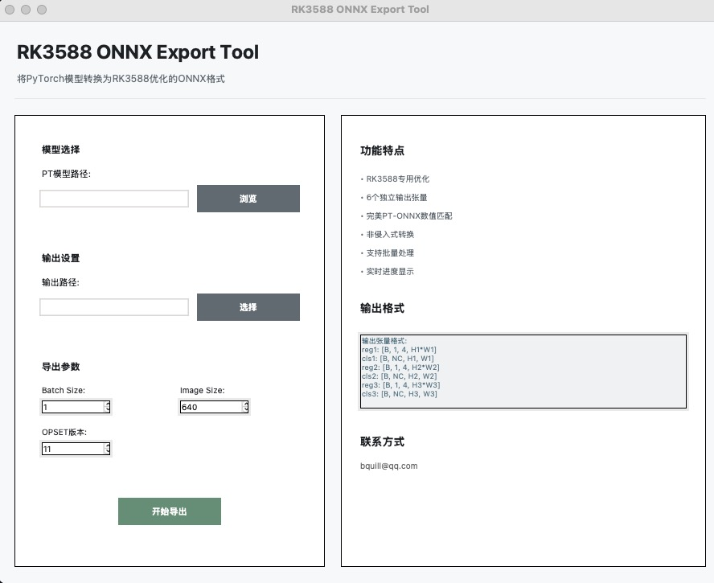

# RK3588 YOLOv8 部署工具集

## 🎯 核心功能：PT → ONNX → RKNN

本项目专注于将PyTorch训练的YOLOv8模型优化部署到瑞芯微RK3588平台。

## 📁 目录结构

```
rk3588_Tutorial/
├── 01_core_conversion/          # ⭐ 核心转换工具
│   ├── simple_rk3588_export.py        # RK3588专用ONNX导出
│   ├── rk3588_export_gui.py           # ONNX导出GUI
│   └── custom_detect_head.py          # 定制检测头
│
├── 02_validation_tools/         # 验证测试工具
│   ├── universal_video_comparator_gui.py # 🎯 P5/P6通用视频对比器
│   ├── modern_dual_comparator.py      # PT vs ONNX可视化对比
│   ├── validate_onnx_cls_format.py    # ONNX格式验证
│   └── verify_letterbox_effect.py     # 预处理效果验证
│
├── 03_annotation_tools/         # 📋 标注工具集
│   ├── auto_annotation_tool_classify.py   # 智能分类标注
│   ├── auto_annotation_tool_modern.py     # 全功能标注
│   ├── auto_annotation_tool_minimal.py    # 极简标注
│   ├── billiard_annotation_tool_modern.py # 台球检测标注
│   └── test_gui_buttons.py              # GUI测试工具
│
├── 04_build_scripts/            # 🔧 打包构建工具
│   ├── build.py               # 跨平台构建主脚本
│   ├── package_release.py     # 发布包生成
│   ├── build_linux.sh         # Linux构建
│   ├── build_macos.sh         # macOS构建
│   ├── build_windows.bat      # Windows构建
│   └── *.spec                 # PyInstaller配置
│
├── 05_ref_data/               # 参考数据
├── 06_models/                 # 🎯 模型文件存放
│   ├── best.pt               # 训练好的PT模型
│   ├── *.onnx                # 导出的ONNX模型
│   └── *.rknn               # RKNN模型
│
├── datasets/                  # 数据集
├── Billiards/                 # 台球检测数据
├── docs/                      # 📋 完整文档
│   ├── tkinter_gui_ultimate_guide.md    # 🎨 GUI开发规范
│   ├── tkinter_gui_archive_*.tar.gz     # 历史归档
│   └── yolov8_*_guide.md                # 技术指南系列
│
├── build/                     # 构建输出目录
├── dist/                      # 分发文件
├── label_sample/              # 标注示例
├── requirements.txt           # 依赖配置
└── README.md                  # 本文件
```

⚠️ **重要说明**：
- 🎯 **推荐使用** `universal_video_comparator_gui.py` 进行模型验证
- 📱 所有GUI工具已统一现代化设计风格
- 🔄 支持P5/P6模型自动适配，无需手动配置

## 📸 界面截图

### 现代化GUI界面展示

**通用视频对比器** - PT vs ONNX 实时对比工具：



**GUI应用集成界面**：



所有GUI工具均采用统一的现代化设计风格，支持实时统计、分类别对比和置信度差异可视化。

## 🚀 快速开始

### 1. PT转ONNX（命令行版）
```bash
cd 01_core_conversion
python simple_rk3588_export.py ../models/best.pt
```

### 2. PT转ONNX（可视化GUI版）
```bash
python 04_gui_applications/rk3588_export_gui.py
```

### 3. 验证转换结果
```bash
# P5/P6通用视频对比器（推荐）
python 02_validation_tools/universal_video_comparator_gui.py

# 静态图片对比
python 02_validation_tools/modern_dual_comparator.py
```

### 4. 数据标注工具
```bash
# 智能分类标注（推荐）
python 03_annotation_tools/auto_annotation_tool_classify.py

# 极简标注
python 03_annotation_tools/auto_annotation_tool_minimal.py
```

### 5. 转换为RKNN
```bash
# GUI版本（推荐）
python 01_core_conversion/rk3588_export_gui.py

# 命令行版本（高级用户）
rknn-toolkit2 convert --onnx ../06_models/best.onnx --target rk3588
```

## 🎨 GUI开发指南

项目已实现现代化的Tkinter GUI系统：[📋 tkinter_gui_ultimate_guide.md](docs/tkinter_gui_ultimate_guide.md)

### 核心特性
- **跨平台兼容** - macOS/Windows/Linux 完美运行
- **卡片式界面** - 清晰的功能分区  
- **实时反馈** - 进度条和状态提示
- **统一风格** - 专业级视觉效果
- **P5/P6兼容** - 通用模型格式支持

### 🎯 重大更新（v3.0-modernized）

#### 通用视频对比器 `universal_video_comparator_gui.py`
- ✅ **P5/P6模型通用支持** - 兼容YOLOv8 P5(640px)和P6(1280px)模型
- ✅ **完美精度匹配** - PT-ONNX置信度差异<0.000001
- ✅ **现代化界面重构** - 遵循终极指南标准
- ✅ **实时视频对比** - 双模型并行推理可视化
- ✅ **差异帧自动保存** - 智能检测并保存有差异的帧
- ✅ **RK3588优化** - 支持6输出ONNX格式(reg1,cls1,reg2,cls2,reg3,cls3)

#### GUI统一化升级
所有GUI工具现已统一采用终极指南设计标准：
- 🎨 统一配色系统（#ff4757主色调）
- 🔧 标准TTK样式（borderwidth=0, focuscolor='none'）
- 📦 标准卡片创建方法
- 🖥️ SF Pro字体族统一

## 📧 联系方式
- Email: bquill@qq.com
- Project: RK3588深度学习平台
